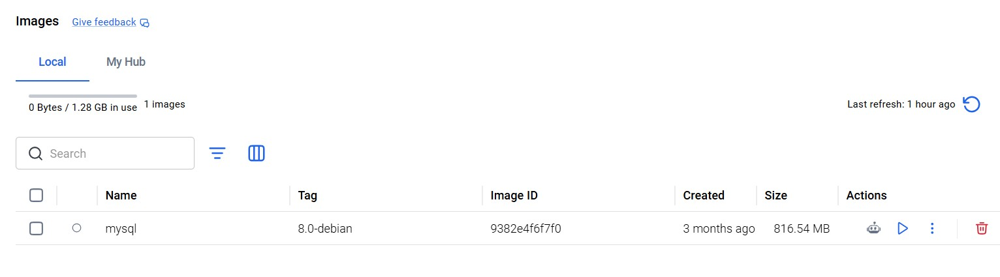
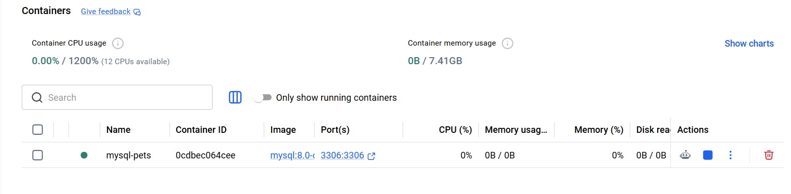
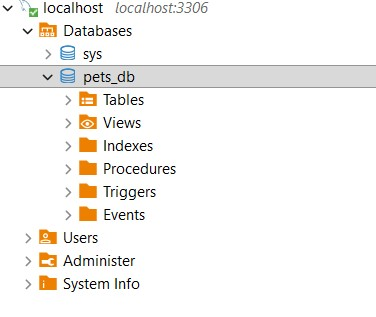
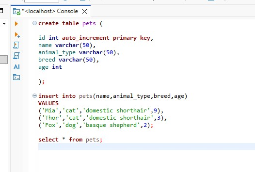
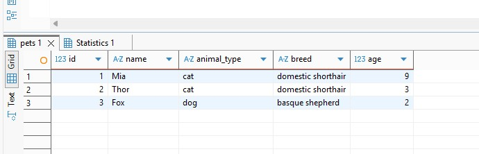
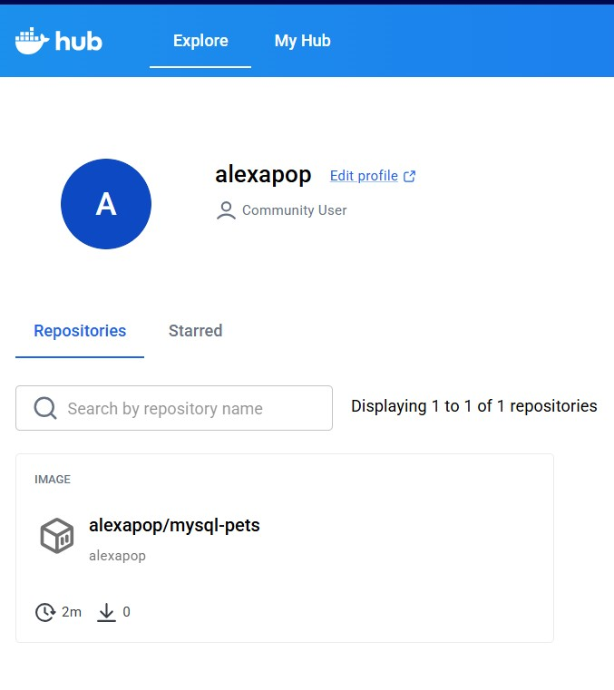

# Docker image & container

## Descripción

Ejercicio práctico para aprender a crear y ejecutar un contenedor de Docker basado en MySQL, conectarse a la base de datos desde una herramienta gráfica y manipular una base de datos sencilla llamada `pets_db`.

## Objetivos

- Aprender a crear un container de Docker.
- Crear una base de datos.
- Manipular una base de datos.
- Subir una imagen a DockerHub.

## Entregables

Captura de pantalla de la sección Images de Docker Desktop.

   

Captura de pantalla de la sección Containers de Docker Desktop.

   

Captura de pantalla de la base de datos creada en DBeaver.

   

Captura de pantalla de la sentencia SQL para listar todas las mascotas y el resultado obtenido.

   

   

Captura de pantalla de DockerHub con la imagen subida.

   
