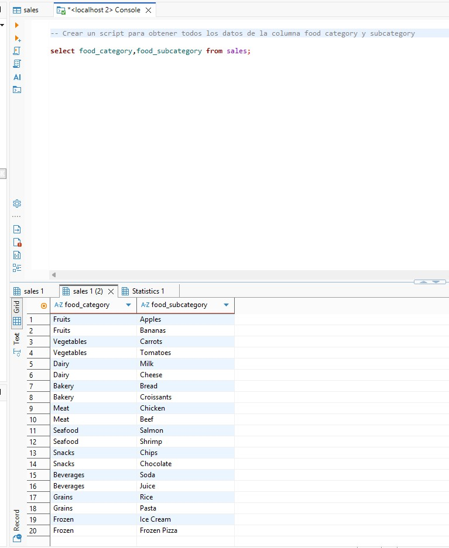
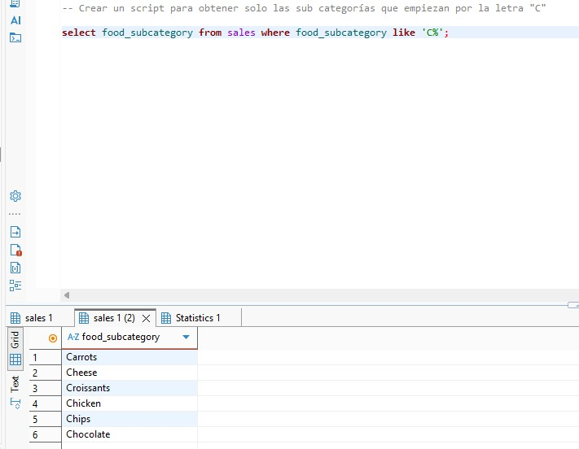
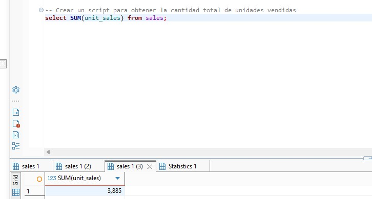
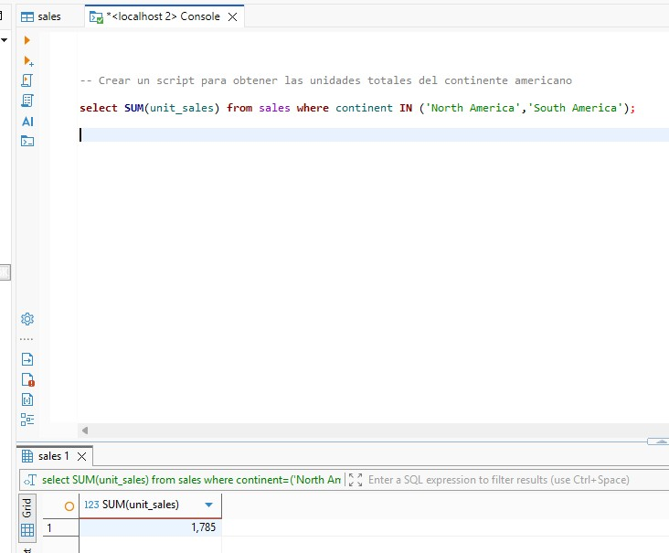

# SQL - Sales

## Descripción

Ejercicio práctico de SQL para crear una base de datos MySQL en Docker, cargar una tabla de ventas llamada `sales` y resolver consultas sobre categorías de comida, subcategorías y unidades vendidas.

## Objetivos

- Crear una base de datos MySQL en Docker.
- Crear la tabla `sales` usando el script proporcionado.
- Obtener todos los datos de las columnas `food_category` y `food_subcategory`.
- Obtener solo las subcategorías que empiezan por la letra `C`.
- Obtener la cantidad total de unidades vendidas.
- Obtener las unidades totales vendidas en el continente americano.
- Alojar el script SQL y la documentación en el repositorio.

## Entregables

Captura de pantalla del script para obtener todos los datos de las columnas `food_category` y `food_subcategory`.

   

Captura de pantalla del script para obtener solo las subcategorías que empiezan por la letra `C`.

   

Captura de pantalla del script para obtener la cantidad total de unidades vendidas.

   

Captura de pantalla del script para obtener las unidades totales del continente americano.

   
