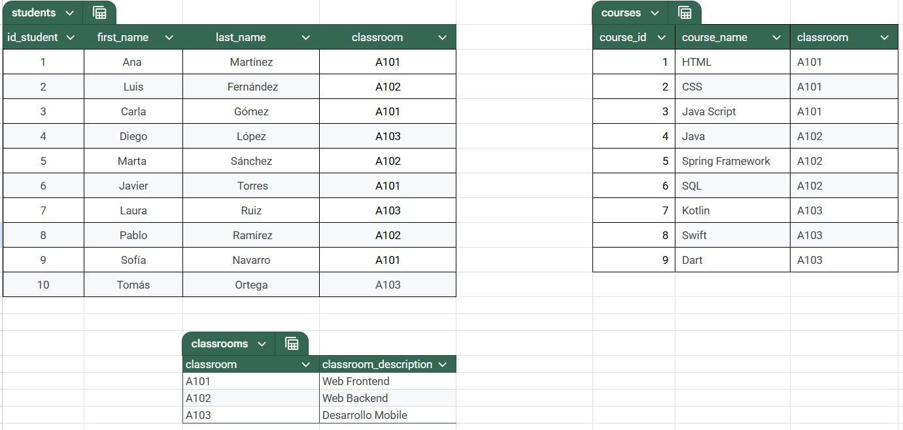
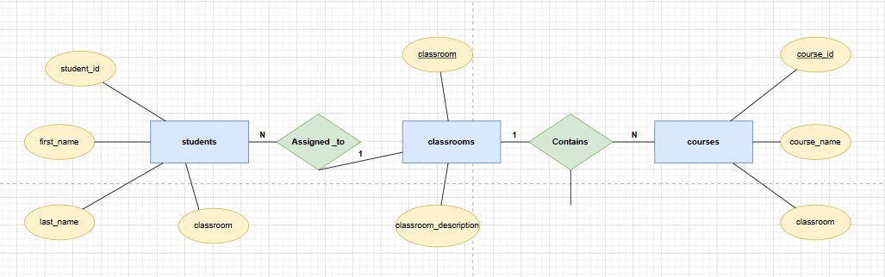
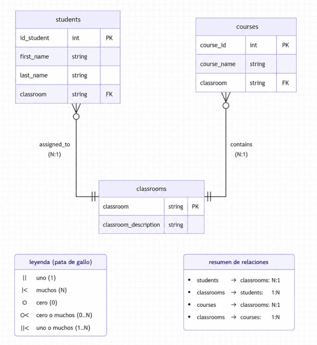

# Students-Classrooms-Courses

## Descripción

Ejercicio de normalización y modelado de datos a partir de una tabla sin normalizar. El objetivo es obtener un diseño relacional correcto y documentar los diagramas.

## Objetivos

- Normalizar la tabla (se recomienda usar Google Sheets)
- Realizar un diagrama ER de Chen
- Realizar un diagrama de tipo "patas de gallo"

## Tabla de datos sin normalizar 
[Students-Classrooms-Courses](Ejercicio%201%20-%20DB.pdf)

**✅ 1NF**
- Ahora la clave primaria (PK) es: `id_student`

*Problemas encontrados*:
- columnas repetidas: `course1`, `course2` y `course3`
- falta de atomicidad en la columna `name_student`

*Solución*:
- Creación de una columna para todos los cursos: `course_name`
- Separación de `name_student` en 2 columnas: `first_name` y `last_name`

*Tablas resultantes*: 
- `students` — PK: `id_student`; columnas: `first_name`, `last_name`, `classroom`, `classroom_description`
- `courses` — PK: `course_id`; columna: `course_name`

**✅ 2NF**

Ahora las claves primarias (PK) son: 

- `id_student` en la tabla `students`
- `course_id` en la tabla `courses`

*Dependencias funcionales:*
 - `students`: `id_student` -> `first_name`, `last_name`, `classroom`
 - `classroom` -> `classroom_description`
 - `courses`: `course_id` -> `course_name`

*Dependencia transitiva:*
 - `id_student` → `classroom` → `classroom_description`

**✅ 3NF**

*Problema encontrado*:
- dependencia transitiva: `classroom_description`

*Solución*:
- Mover el `classroom_description` a la tabla que lo determina (`classrooms`) y dejar en `students` solo la referencia (FK: `classroom`) a `classrooms`.

**Modelo final**: 

- `students` — PK: `id_student`; columnas: `first_name`, `last_name`, `classroom` (FK → `classrooms.classroom`)
- `courses` — PK: `course_id`; columnas: `course_name`, `classroom` (FK → `classrooms.classroom`)
- `classrooms` — PK: `classroom`; columna: `classroom_description`

 

## Relaciones entre tablas

- `students` → `courses`: muchos a uno (`N:1`)
  - Cada estudiante está asociado a un solo curso.
- `courses` → `students`: uno a muchos (`1:N`)
  - Un curso puede tener varios estudiantes inscritos.

- `students` → `classrooms`: muchos a uno (`N:1`)
  - Cada estudiante pertenece a un solo aula.
- `classrooms` → `students`: uno a muchos (`1:N`)
  - Un aula puede contener muchos estudiantes.

- `courses` → `classrooms`: muchos a uno (`N:1`)
  - Cada curso se imparte en un solo aula.
- `classrooms` → `courses`: uno a muchos (`1:N`)
  - Un aula puede ser usada por varios cursos.

## Entregables
**Diagrama Chen**

**Diagrama UML Patas de gallo**

